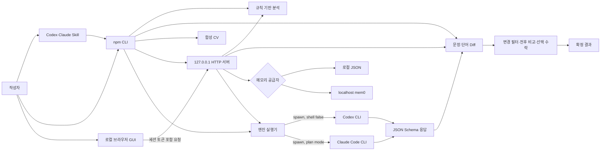
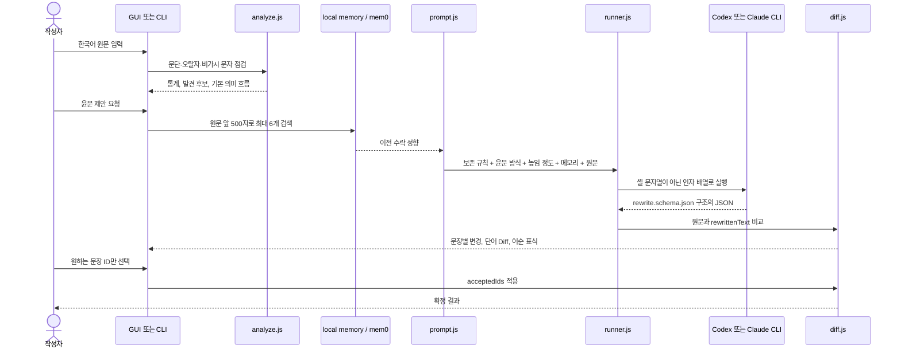
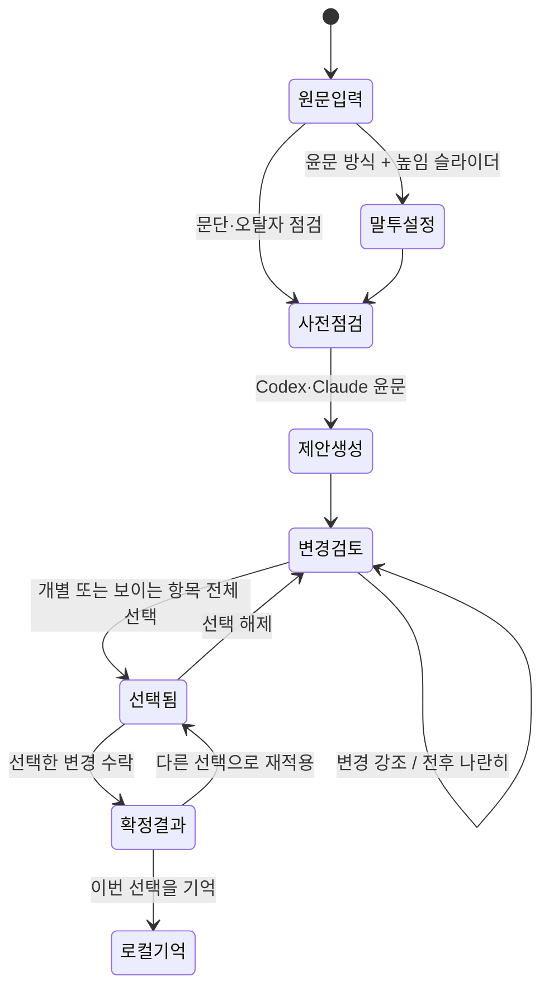
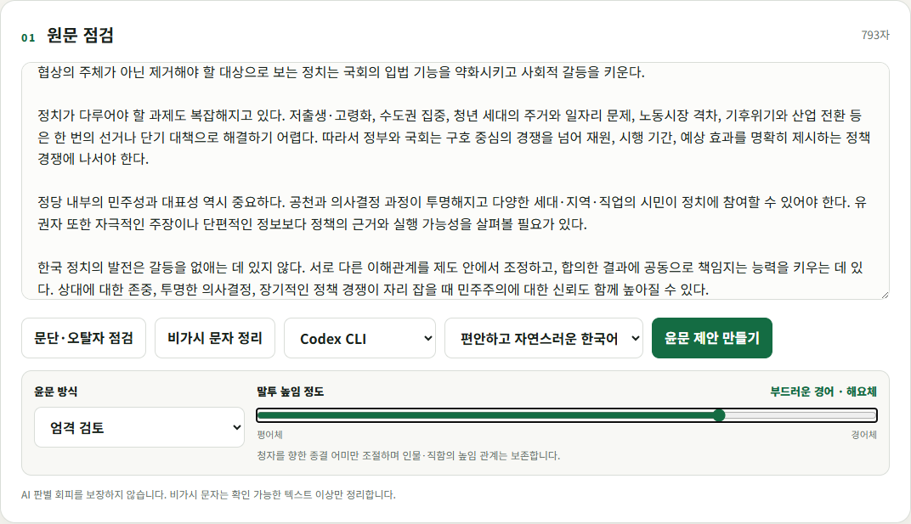
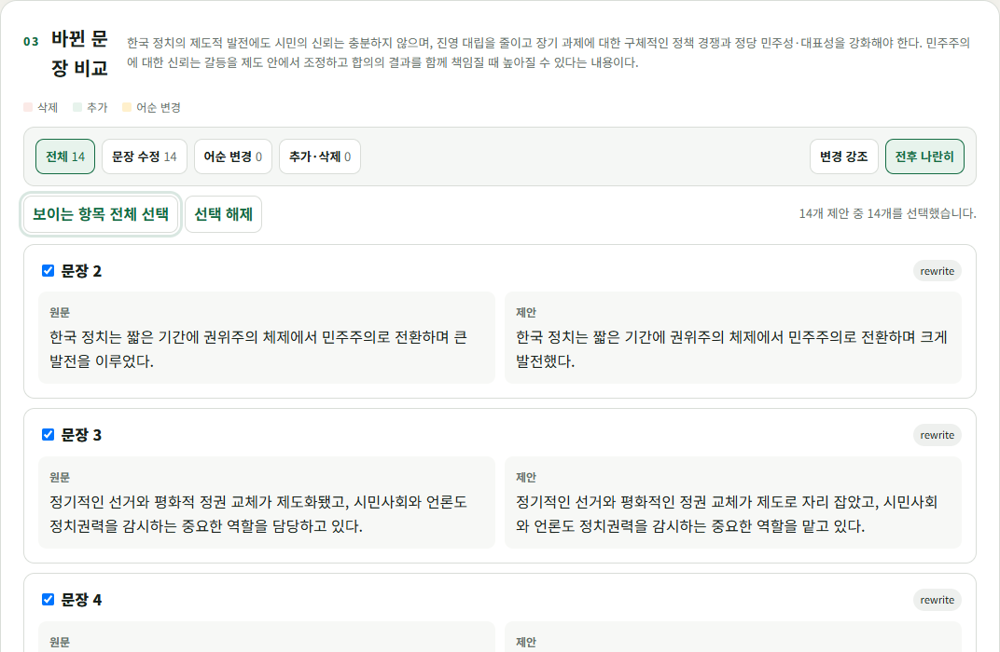
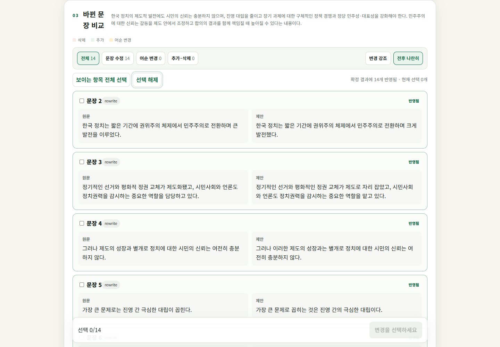
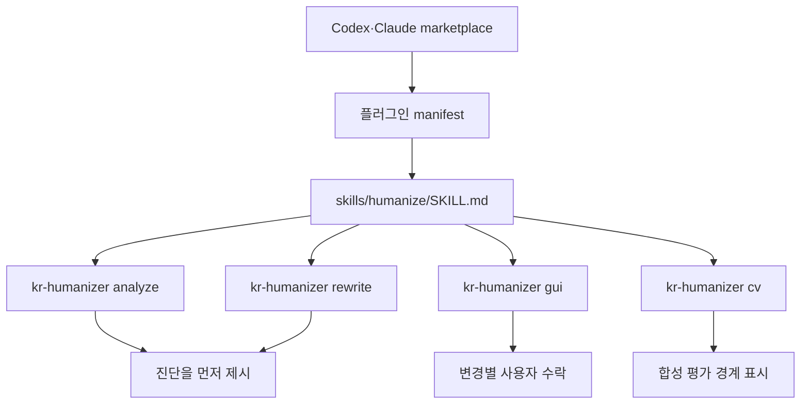
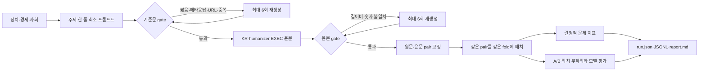
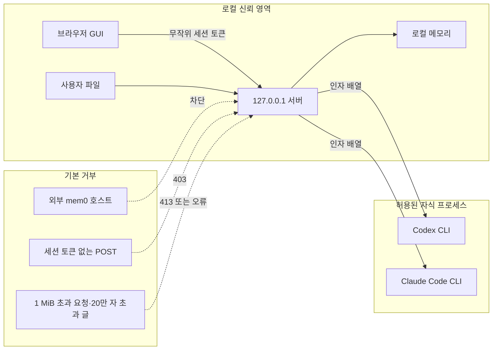

# KR-humanizer

한국어 글을 더 자연스럽고 편하게 읽히도록 점검하고, 모든 변경을 사용자가 확인·수락하게 하는 로컬 우선 윤문 도구입니다.

> 이 도구는 AI 판별기 회피나 출처 위장을 보장하지 않습니다. `sanitize`는 비가시 Unicode, BOM, 제어문자처럼 실제로 확인 가능한 텍스트 이상만 보여 주고 정리합니다.

## 현재 제공 범위

- 문단·문장 길이, 중복 표현, 기본 오탈자, 비가시 문자 진단
- Codex CLI 또는 Claude Code CLI를 통한 API 키 없는 윤문 제안
- 문장/단어 단위 전후 비교, 어순 변경 표식, 선택 수락
- 평어체부터 경어체까지 5단계 말투 높임 슬라이더와 4가지 윤문 방식
- 글의 의미 흐름 그래프
- 로컬 결정 메모리와 선택적 self-hosted mem0 연동
- npm CLI와 로컬 브라우저 GUI
- Codex 및 Claude Code 공용 플러그인

## 설치와 실행

Node.js 20 이상이 필요합니다.

```bash
npm install
npm test
npm link
kr-humanizer analyze draft.txt
kr-humanizer rewrite draft.txt --engine codex --mode balanced --honorific 75 --out proposal.json
kr-humanizer cv --samples 3 --folds 3
kr-humanizer gui
```

공개 저장소에서 바로 설치하려면:

```bash
npm install -g github:kuseumkkrkkr/KR-humanizer
```

GitHub Release의 `kr-humanizer-0.4.0.tgz` 파일도 동일한 npm 설치물입니다. npm registry에는 아직 게시하지 않았습니다.

Claude Code가 설치되어 있으면 `--engine claude`를 사용할 수 있습니다. 외부 모델 API를 직접 호출하지 않으며, 사용자가 로그인한 CLI 프로세스만 실행합니다.

## 플러그인 설치

Codex:

```bash
codex plugin marketplace add kuseumkkrkkr/KR-humanizer
codex plugin add kr-humanizer@kr-humanizer
```

Claude Code:

```bash
claude plugin marketplace add kuseumkkrkkr/KR-humanizer
claude plugin install kr-humanizer@kr-humanizer
```

## 개인정보와 보안

- GUI 서버는 `127.0.0.1`에만 바인딩됩니다.
- 입력은 기본적으로 외부 서버에 저장하거나 전송하지 않습니다.
- CLI 실행은 셸 문자열이 아닌 인자 배열을 사용합니다.
- mem0는 localhost 주소만 허용하며 기본값은 비활성입니다.
- 원문은 200,000자, 요청 본문은 1 MiB로 제한됩니다.

자세한 제품 범위와 근거는 [docs/PLAN.md](docs/PLAN.md), [docs/RESEARCH.md](docs/RESEARCH.md)를 참고하세요.

## 합성 CV

`cv` 명령은 정치·경제·사회 주제별 최소 프롬프트 원문과 윤문문을 pair 단위 3-fold로 나눕니다. 설명 가능한 문체 지표, A/B 위치를 무작위화한 모델 평가, 원문/윤문 문체 구분 실험을 함께 저장합니다. 사람이 쓴 기준 글이나 실제 독자 평가는 포함하지 않으므로 사람다움 정확도로 해석하면 안 됩니다.

최종 실행은 `experiments/runs/2026-09-04T06-22-37-885Z/`에 기준문 9개, EXEC 윤문 9개, 평가 의견 9개로 분리 저장했습니다. 실제 GUI 동작 캡처는 `artifacts/screenshots/`에서 확인할 수 있습니다.

프롬프트 조건과 9개 원문·윤문을 글별로 연속 비교하려면 [A/B 글 비교 보고서](experiments/runs/2026-09-04T06-22-37-885Z/ab-comparison.md)를 확인하세요.

## 전체 구조



사용자 입력은 CLI 또는 `127.0.0.1` GUI에서 시작합니다. 맞춤법 후보와 문단 통계는 로컬 규칙으로 계산하고, 윤문이 필요할 때만 사용자가 로그인한 Codex CLI 또는 Claude Code CLI 프로세스를 실행합니다. 별도 모델 API 키를 읽거나 외부 LLM HTTP API를 직접 호출하지 않습니다.

## 구성요소와 실제 파일

| 계층 | 파일 | 역할 |
|---|---|---|
| 명령 진입점 | `bin/kr-humanizer.js`, `src/cli.js` | 인자 해석, 파일·표준입력 처리, 명령 라우팅 |
| 한국어 분석 | `src/core/analyze.js`, `data/ko-rules.json` | 문장 분리, 문단·문장 통계, 규칙 후보, 장문, 비가시 문자 검사 |
| 변경 계산 | `src/core/diff.js` | 문장 정렬, 단어 단위 LCS, 어순 변경 표식, 선택 변경 적용 |
| 문체 제어 | `src/core/style.js` | 5단계 상대 높임 프로필과 4가지 윤문 방식 검증 |
| 프롬프트 | `src/core/prompt.js` | 의미 보존 규칙, 목표 문체, 높임·윤문 방식, 이전 수락 성향, 원문 결합 |
| 실행기 | `src/engines/runner.js` | Codex·Claude 자식 프로세스 실행, 시간·출력 제한, 구조화 JSON 파싱 |
| GUI | `src/gui/index.html`, `app.js`, `styles.css`, `server.js` | 로컬 편집·검토 UI와 토큰 보호 HTTP API |
| 메모리 | `src/memory/` | 기본 로컬 JSON 또는 localhost 전용 mem0 검색·기록 |
| 합성 CV | `src/benchmark/`, `schemas/`, `data/cv-topics.json` | 최소 프롬프트 생성, 윤문, fold 분리, 지표·A/B 위치 무작위화 의견 저장 |
| 플러그인 | `plugins/kr-humanizer/`, `.agents/`, `.claude-plugin/` | Codex·Claude 마켓플레이스 메타데이터와 공용 Skill |

### CLI 도구 표면

| 명령 | 입력 | 출력·부작용 |
|---|---|---|
| `analyze` | 파일 또는 표준입력 | 통계, 규칙 후보, 의미 흐름 JSON |
| `sanitize` | 파일 또는 표준입력 | 확인된 비가시 문자를 제거한 UTF-8 텍스트; `--out`을 줬을 때만 파일 작성 |
| `rewrite` | 원문, 엔진, 문체, `--mode`, `--honorific` | 구조화 윤문 응답을 문장별 proposal JSON으로 변환 |
| `review` | 원문 파일 + 별도 윤문 파일 | 모델 실행 없이 두 글의 Diff proposal 생성 |
| `accept` | proposal JSON + 문장 ID | 선택한 변경만 반영한 텍스트 생성 |
| `cv` | 샘플·fold 수 | 합성 원문, EXEC 윤문, 지표, A/B 위치 무작위화 의견 파일 저장 |
| `gui` | 포트 | `127.0.0.1` 로컬 검토 서버 실행 |

파일을 생략하거나 `-`를 지정하면 표준입력을 읽습니다. `rewrite`와 `cv`를 제외한 핵심 분석·Diff·수락 명령은 모델 없이 결정적으로 실행됩니다.

### 런타임 라이브러리

런타임 npm 의존성은 없습니다. Node.js 20 이상의 표준 기능만 사용합니다.

| 기능 | 사용 모듈·API |
|---|---|
| 파일·원자적 저장 | `node:fs/promises`, 임시 파일 작성 후 `rename` |
| 로컬 서버 | `node:http`, `URL` |
| CLI 실행 | `node:child_process.spawn` |
| 임시 결과·경로 | `node:os`, `node:path`, `node:url` |
| 토큰·식별자 | `node:crypto`의 `randomBytes`, `randomUUID`, `createHash` |
| 한국어 문장 분리 | `Intl.Segmenter('ko')` |
| localhost mem0 | Node 내장 `fetch`, `AbortSignal.timeout` |

Playwright는 제품 런타임이 아니라 `scripts/capture-gui.cjs`의 화면 검증에만 선택적으로 사용됩니다.

## 윤문 요청의 내부 흐름



### 실제 윤문 프롬프트

`buildRewritePrompt()`는 다음 정보를 한 요청으로 조립합니다.

1. 사실·고유명사·수치·주장·관점을 바꾸지 말라는 보존 조건
2. 사용자가 고른 목표 문체
3. `fluent`, `balanced`, `strict`, `concise` 중 선택한 윤문 방식
4. 0~100 높임 정도와 이에 대응하는 상대 높임 등급
5. 과장된 접속어와 상투 표현을 줄이고 구체적인 동사와 짧은 문장을 우선하는 편집 규칙
6. AI 판별기 회피와 출처 위장을 하지 않는다는 경계
7. 로컬 메모리에서 검색한 이전 수락 성향
8. 구분선 안의 원문 전체

응답은 `schemas/rewrite.schema.json`으로 제한합니다. 필수 필드는 윤문 본문 `rewrittenText`, 요약 `summary`, 의미 흐름 노드 `flow`, 관계 `edges`입니다. 스키마에 맞지 않거나 필드가 빠지면 결과를 적용하지 않고 오류로 처리합니다.

### 엔진별 실행 차이

| 엔진 | 실행 방식 | 상태 보존 |
|---|---|---|
| Codex | `codex exec --sandbox read-only --ephemeral --output-schema ...` | 세션을 남기지 않고 마지막 구조화 메시지만 임시 파일로 수신 |
| Claude Code | `claude -p --output-format json --json-schema ... --permission-mode plan --no-session-persistence` | plan 권한과 비영속 세션으로 실행 |

두 경로 모두 `spawn(..., { shell: false })`를 사용하며 기본 제한은 실행 180초, 출력 2 MiB입니다.

## 문장 수정 UX와 적용 원리



- **유형 필터:** 전체, 문장 수정, 어순 변경, 추가·삭제로 제안을 좁힙니다. 필터는 표시만 바꾸며 이미 선택한 문장을 임의로 해제하지 않습니다.
- **두 가지 비교:** `변경 강조`는 삭제·추가 단어를 한 문장 안에 표시하고, `전후 나란히`는 원문과 제안을 분리해 긴 문장을 비교합니다.
- **일괄 선택:** 현재 보이는 변경만 한 번에 선택하거나 전체 선택을 해제할 수 있습니다.
- **명시적 수락:** 선택이 없으면 수락 버튼이 비활성화됩니다. 선택 수는 `선택 3/12`처럼 표시되고, 반영한 문장 카드에는 `반영됨` 상태가 남습니다.
- **원본 보존:** 제안 생성만으로 원문을 덮어쓰지 않습니다. `applyProposal()`은 선택된 문장 ID만 원문의 뒤쪽 위치부터 적용해 앞 문장의 인덱스가 밀리지 않게 합니다.

문장별 Diff는 토큰 단위 최장 공통 부분 수열(LCS)을 사용합니다. 두 문장의 단어 집합 유사도가 0.6 이상인데 위치가 다르면 `order`로 표시합니다. 토큰 조합이 250,000개를 넘으면 메모리 폭증을 막기 위해 문장 전체 삭제·추가 표시로 폴백합니다.

### 말투 높임 슬라이더

UI의 `평어체`와 `경어체`는 이해를 돕는 넓은 범주이고, 실제 프롬프트에는 국립국어원이 설명하는 상대 높임 등급을 명시합니다. 슬라이더는 25 단위로 움직이며 기본값 50은 원문의 우세한 종결 어미를 유지합니다. 높임 조절은 청자를 향한 종결 어미에만 적용하고, 원문 속 인물·직함에 대한 주체 및 객체 높임 관계는 바꾸지 않습니다. [국립국어원은 상대 높임법을 해라체·하게체·하오체·하십시오체·해체·해요체 등으로 구분합니다.](https://www.korean.go.kr/front/onlineQna/onlineQnaView.do?mn_id=27&pageIndex=1&qna_seq=332328)

| 값 | 화면 표시 | 적용 원칙 |
|---:|---|---|
| 0 | 평어 · 해체 | 친근한 비격식 평어. 무례한 표현은 새로 만들지 않음 |
| 25 | 서술형 평어 · 해라체 | 설명문 중심의 `-다`, `-한다` 계열 |
| 50 | 중립 · 원문 유지 | 원문에서 우세한 상대 높임 등급 유지 |
| 75 | 부드러운 경어 · 해요체 | `-아요`, `-어요`, `-예요` 계열 |
| 100 | 격식 경어 · 하십시오체 | `-습니다/-ㅂ니다`, `-습니까` 계열 |



### 검증된 GUI 화면

전후 나란히 보기와 보이는 항목 전체 선택:



수락 후 선택을 해제해도 확정 결과에 반영된 카드 상태는 유지됩니다.



## Skill과 플러그인 작동 방식



Codex와 Claude용 manifest는 같은 `humanize-korean-writing` Skill을 가리킵니다. Skill은 진단을 먼저 보여 주고, 원본을 덮어쓰지 않으며, 어순 변경을 표시하고, 사용자가 수락한 문장만 적용하도록 실행 순서를 정의합니다. 플러그인은 자체 모델이나 원격 서비스를 포함하지 않으며 npm CLI를 호출하는 사용 지침과 실행 래퍼를 제공합니다.

### 다른 Humanizer에서 선별한 편집 원리

공개된 공식 기능 설명을 비교해 다음 원리만 독립적으로 구현했습니다. 외부 제품의 코드·프롬프트·규칙 데이터는 포함하지 않습니다.

| KR-humanizer 기능 | 참고한 공개 원리 | 적용 경계 |
|---|---|---|
| `fluent` 최소 수정 | [QuillBot Fluency는 문법과 자연스러움에 집중하고 변경과 동의어 치환을 줄임](https://help.quillbot.com/hc/en-us/articles/35854318883351-What-are-modes-in-the-QuillBot-Paraphraser-and-how-do-I-use-them) | 의미 없는 단어 교체 금지 |
| 독자 관점 말투 점검 | [Grammarly는 글이 더 친근하고 긍정적이며 자신감 있게 들리도록 문장별 말투 제안을 제공](https://support.grammarly.com/hc/en-us/articles/10674801783309-How-do-Grammarly-s-tone-suggestions-work) | 성격 판단이 아닌 독자가 받는 인상만 검토 |
| 격식·간결 조절 | [Wordtune은 Formal/Casual과 Shorten/Expand 제어를 제공](https://www.wordtune.com/rewrite) | 사실 추가 위험이 있는 Expand는 제외 |
| `strict` 엄격 검토 | [LanguageTool Picky Mode는 격식 문맥에서 더 많은 문법·문체 제안을 표시](https://languagetool.org/insights/post/picky-mode/) | 자동 반영하지 않고 문장별 수락 유지 |

윤문 방식은 `fluent`(최소 수정), `balanced`(균형 편집), `strict`(문체 혼용과 모호성까지 검토), `concise`(근거를 보존한 간결화) 네 가지입니다. 의미가 달라질 수 있는 창작 모드와 근거 없는 내용 확장은 넣지 않았습니다.

## 메모리 구조

- 기본 `LocalMemoryStore`는 `%USERPROFILE%/.kr-humanizer/memory.json`에 최대 500개 결정을 보관합니다.
- 파일은 임시 파일에 먼저 쓴 뒤 `rename`하며, 생성 시 권한 모드는 `0600`을 요청합니다.
- 검색은 질의와 저장 문장의 공통 공백 토큰 수로 정렬하는 단순 로컬 방식입니다.
- mem0를 고르면 `127.0.0.1`, `localhost`, `::1`만 허용합니다. 검색 제한은 10초이며 외부 호스트 주소는 생성 단계에서 거부합니다.
- GUI의 `이번 선택을 로컬에 기억`을 눌러야 선택 ID가 저장됩니다. 자동 학습이나 백그라운드 업로드는 없습니다.

## 합성 CV 데이터 흐름



CV는 정치·경제·사회 각 3개 원문과 그 윤문을 만듭니다. 원문과 대응 윤문은 항상 같은 fold에 있어 pair 누수를 막습니다. 숫자 토큰 보존, 길이비, 가독성 대리 지표, 문체 구분기와 A/B 위치 무작위화 의견을 별도로 기록합니다. 평가 프롬프트에는 의미 보존 확인을 위한 참조 원문이 함께 제공되므로 평가자가 원문과 같은 문안을 식별할 수 있습니다. 따라서 완전한 블라인드 실험이 아니며, 같은 Codex 계열이 생성·윤문·평가한다는 점까지 포함해 실제 사람 선호나 AI 판별 회피 성능으로 해석할 수 없습니다.

## 보안과 신뢰 경계



- 서버는 모든 인터페이스가 아닌 `127.0.0.1`에만 바인딩합니다.
- HTML에 매 실행 무작위 토큰을 넣고 모든 POST 요청의 `x-kr-humanizer-token`과 비교합니다.
- 응답에는 CSP, `frame-ancestors 'none'`, `nosniff`, `no-referrer`, `no-store` 헤더를 설정합니다.
- 요청 본문은 1 MiB, 분석 원문은 200,000자, 엔진 출력은 2 MiB로 제한합니다.
- 비가시 문자 정리는 탐지된 Unicode 제어문자만 제거하고 NFC 정규화를 적용합니다. 이를 AI 워터마크 검출이나 제거라고 주장하지 않습니다.

## 현재 한계

- 규칙 기반 분석은 교정 후보를 보여 주며 국립국어원 수준의 완전한 문법 판정기가 아닙니다.
- 문장 정렬은 동일 인덱스를 우선하는 휴리스틱이라 문단 전체 재구성에는 적합하지 않습니다.
- 로컬 메모리 검색은 의미 임베딩이 아니라 토큰 겹침 점수입니다.
- 최신 사실 검증, 정치적 편향 평가, 실제 독자 실험은 현재 CV 범위 밖입니다.
