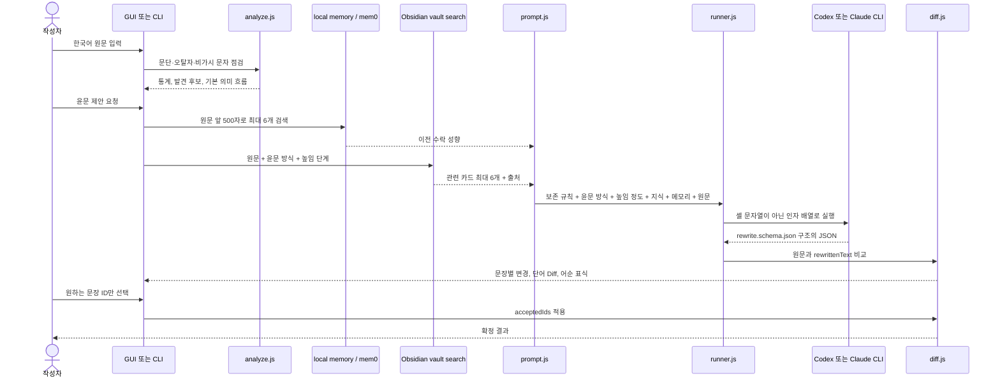

## 구성요소와 실제 파일

| 계층 | 파일 | 역할 |
|---|---|---|
| 명령 진입점 | `bin/kr-humanizer.js`, `src/cli.js` | 인자 해석, 파일·표준입력 처리, 명령 라우팅 |
| 한국어 분석 | `src/core/analyze.js`, `data/ko-rules.json` | 문장 분리, 문단·문장 통계, 규칙 후보·장문·비가시 문자 검사 |
| 변경 계산 | `src/core/diff.js` | 문장 정렬, 단어 단위 LCS, 어순 변경 표식, 선택한 변경 적용 |
| 문체 제어 | `src/core/style.js` | 5단계 상대 높임 프로필과 4가지 윤문 방식 검증 |
| 프롬프트 | `src/core/prompt.js` | 의미 보존 규칙, 목표 문체, 높임·윤문 방식, 이전 수락 성향, 원문 결합 |
| 지식 검색 | `src/knowledge/vault.js`, `obsidian-vault/` | Markdown 카드 파싱, 입력별 점수화, 출처를 포함한 상위 지침 선택 |
| 실행기 | `src/engines/runner.js` | Codex·Claude 자식 프로세스 실행, 시간·출력 제한, 구조화된 JSON 파싱 |
| GUI | `src/gui/index.html`, `app.js`, `styles.css`, `server.js` | 로컬 편집·검토 UI와 토큰 보호용 HTTP API |
| 메모리 | `src/memory/` | 기본 로컬 JSON 또는 localhost 전용 mem0 검색·기록 |
| 합성 CV | `src/benchmark/`, `schemas/`, `data/cv-topics.json` | 최소 프롬프트 생성, 윤문, fold 분리, 지표 및 A/B 위치를 무작위화한 의견 저장 |
| 플러그인 | `plugins/kr-humanizer/`, `.agents/`, `.claude-plugin/` | Codex·Claude 마켓플레이스 메타데이터와 공용 Skill |

### CLI 도구 표면

| 명령 | 입력 | 출력·부작용 |
|---|---|---|
| `analyze` | 파일 또는 표준입력 | 통계, 규칙 후보, 의미 흐름 JSON |
| `sanitize` | 파일 또는 표준입력 | 확인된 비가시 문자를 제거한 UTF-8 텍스트. `--out`을 지정한 경우에만 파일 작성 |
| `knowledge` | 원문, `--mode`, `--honorific`, 선택 사항인 `--vault` | 모델 실행 없이 관련 지식 카드와 출처를 JSON으로 반환 |
| `rewrite` | 원문, 엔진, 문체, `--mode`, `--honorific` | 구조화된 윤문 응답을 문장별 proposal JSON으로 변환 |
| `review` | 원문 파일 + 별도 윤문 파일 | 모델 실행 없이 두 글의 Diff proposal 생성 |
| `accept` | proposal JSON + 문장 ID | 선택한 변경만 반영한 텍스트 생성 |
| `cv` | 샘플·fold 수 | 합성 원문, EXEC 윤문, 지표, A/B 위치를 무작위화한 의견 파일 저장 |
| `gui` | 포트 | `127.0.0.1`에서 로컬 검토 서버 실행 |

파일을 생략하거나 `-`를 지정하면 표준입력을 읽습니다. `rewrite`와 `cv`를 제외한 핵심 분석·Diff·수락 명령은 모델 없이 결정적으로 실행됩니다.

### 런타임 라이브러리

런타임 npm 의존성은 없습니다. Node.js 20 이상에서 제공하는 표준 기능만 사용합니다.

| 기능 | 사용 모듈·API |
|---|---|
| 파일·원자적 저장 | `node:fs/promises`, 임시 파일 작성 후 `rename` |
| 로컬 서버 | `node:http`, `URL` |
| CLI 실행 | `node:child_process.spawn` |
| 임시 결과·경로 | `node:os`, `node:path`, `node:url` |
| 토큰·식별자 | `node:crypto`의 `randomBytes`, `randomUUID`, `createHash` |
| 한국어 문장 분리 | `Intl.Segmenter('ko')` |
| localhost mem0 | Node 내장 `fetch`, `AbortSignal.timeout` |

Playwright는 제품 런타임이 아니라 `scripts/capture-gui.cjs`의 화면 검증에만 선택적으로 사용됩니다.

## 윤문 요청의 내부 흐름

### 실제 윤문 프롬프트

`buildRewritePrompt()`는 다음 정보를 하나의 요청으로 조립합니다.

1. 사실·고유명사·수치·주장·관점을 바꾸지 말라는 보존 조건
2. 사용자가 고른 목표 문체
3. `fluent`, `balanced`, `strict`, `concise` 중에서 선택한 윤문 방식
4. 0~100의 높임 정도와 이에 대응하는 상대 높임 등급
5. 과장된 접속어와 상투 표현을 줄이고 구체적인 동사와 짧은 문장을 우선하는 편집 규칙
6. AI 판별기 회피와 출처 위장을 하지 않는다는 경계
7. Obsidian 저장소에서 검색한 규범·편집 지침과 출처
8. 로컬 메모리에서 검색한 이전 수락 성향
9. 구분선 안의 원문 전체

응답은 `schemas/rewrite.schema.json`으로 제한합니다. 필수 필드는 윤문 본문 `rewrittenText`, 요약 `summary`, 의미 흐름 노드 `flow`, 관계 `edges`입니다. 스키마에 맞지 않거나 필드가 빠지면 결과를 적용하지 않고 오류로 처리합니다.

