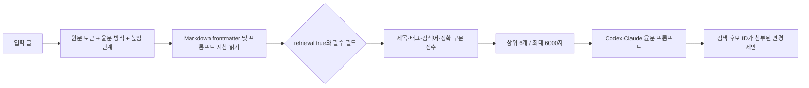
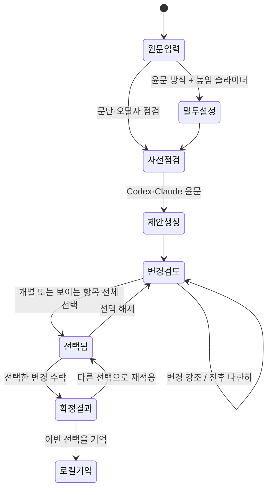

## Obsidian 윤문 지식 저장소

`obsidian-vault/`는 Obsidian에서 그대로 열 수 있는 Markdown 폴더이며, Obsidian 자체는 실행 필수 조건이 아닙니다. 검색기는 플러그인 API나 임베딩 서버 없이 `.md` 파일을 직접 읽습니다. 기본 카드 14개는 국립국어원 규범·글쓰기 자료 9개와 공개 한국어 윤문 Skill의 작업 방식 관찰 5개로 나뉩니다.



각 카드는 `id`, `kind`, `authority`, `source_url`, `source_section`, `tags`, `retrieval_terms`와 `프롬프트 지침`을 가집니다. 이 필드가 하나라도 없으면 검색에서 제외합니다. `규범/` 카드는 국립국어원의 해당 조항이나 자료를 짧게 재구성했고, `skills/` 카드는 공개 Skill의 단계·검증 방식만 요약했습니다. 원문 전체나 외부 프롬프트를 복제하지 않습니다. 출처가 명시되지 않았거나 적용 조건이 불분명한 노트는 검색 카드로 쓰지 않습니다.

- 제목·출처 절 일치: 토큰당 5점
- 태그 일치: 토큰당 4점
- 검색어 일치: 토큰당 7점
- 입력에 정확 구문 포함: 12점
- 지침 본문 일치: 토큰당 1점

점수는 관련도 정렬에만 사용합니다. 규범의 권위 점수가 아니며, 프롬프트에서는 국립국어원 규범을 공개 Skill 관찰보다 우선합니다. 같은 입력과 저장소에는 같은 결과가 나오도록 경로와 ID를 안정적으로 정렬합니다.

검색된 카드는 모델에 제공된 후보이며, 모델이 특정 변경에 실제 적용했다는 뜻은 아닙니다. 사용자 Vault는 `--vault`를 지정한 사람이 신뢰한 로컬 입력으로 취급합니다. 동기화·공유받은 미검토 폴더를 지정하지 마세요. 카드 내용은 참고 자료 구획으로 감싸며 규칙 무시나 외부 행동을 요구하는 문장은 따르지 않도록 프롬프트에 명시합니다. 파일당 128 KiB, Markdown 1,000개, 합계 8 MiB, 폴더 깊이 8단계로 순회를 제한합니다.

사용자가 추가한 Obsidian 저장소도 같은 카드 형식으로 검색할 수 있습니다.

```bash
kr-humanizer knowledge draft.txt --vault D:\\my-writing-vault --limit 6
kr-humanizer rewrite draft.txt --engine codex --vault D:\\my-writing-vault --out proposal.json
```

내장 카드 목록과 연결 관계는 [윤문 지식 지도](obsidian-vault/00-윤문-지식-지도.md), 새 카드 형식은 [지식 카드 템플릿](obsidian-vault/templates/지식-카드.md)에서 확인할 수 있습니다. 기준 자료는 [국립국어원 한국어 어문 규범](https://www.korean.go.kr/kornorms/m/m_regltn.do), [상대 높임 설명](https://www.korean.go.kr/front/onlineQna/onlineQnaView.do?mn_id=27&pageIndex=1&qna_seq=332328), 국립국어원 공공언어·글쓰기 연구 자료입니다.

### 엔진별 실행 차이

| 엔진 | 실행 방식 | 상태 보존 |
|---|---|---|
| Codex | `codex exec --sandbox read-only --ephemeral --output-schema ...` | 세션을 남기지 않고 마지막 구조화 메시지만 임시 파일로 수신 |
| Claude Code | `claude -p --output-format json --json-schema ... --permission-mode plan --no-session-persistence` | plan 권한과 비영속 세션으로 실행 |

두 경로 모두 `spawn(..., { shell: false })`를 사용하며 기본 제한은 실행 180초, 출력 2 MiB입니다.

## 문장 수정 UX와 적용 원리



- **유형 필터:** 전체, 문장 수정, 어순 변경, 추가·삭제로 제안을 좁힙니다. 필터는 표시만 바꾸며 이미 선택한 문장을 임의로 해제하지 않습니다.
- **두 가지 비교:** `변경 강조`는 삭제·추가 단어를 한 문장 안에 표시하고, `전후 나란히`는 원문과 제안을 분리해 긴 문장을 비교합니다.
- **일괄 선택:** 현재 보이는 변경만 한 번에 선택하거나 전체 선택을 해제할 수 있습니다.
- **명시적 수락:** 선택이 없으면 수락 버튼이 비활성화됩니다. 선택 수는 `선택 3/12`처럼 표시되고, 반영한 문장 카드에는 `반영됨` 상태가 남습니다.
- **원본 보존:** 제안 생성만으로 원문을 덮어쓰지 않습니다. `applyProposal()`은 선택된 문장 ID만 원문의 뒤쪽 위치부터 적용해 앞 문장의 인덱스가 밀리지 않게 합니다.

문장별 Diff는 토큰 단위 최장 공통 부분 수열(LCS)을 사용합니다. 두 문장의 단어 집합 유사도가 0.6 이상인데 위치가 다르면 `order`로 표시합니다. 토큰 조합이 250,000개를 넘으면 메모리 폭증을 막기 위해 문장 전체 삭제·추가 표시로 폴백합니다.

### 말투 높임 슬라이더

UI의 `평어체`와 `경어체`는 이해를 돕는 넓은 범주이고, 실제 프롬프트에는 국립국어원이 설명하는 상대 높임 등급을 명시합니다. 슬라이더는 25 단위로 움직이며 기본값 50은 원문의 우세한 종결 어미를 유지합니다. 높임 조절은 청자를 향한 종결 어미에만 적용하고, 원문 속 인물·직함에 대한 주체 및 객체 높임 관계는 바꾸지 않습니다. [국립국어원은 상대 높임법을 해라체·하게체·하오체·하십시오체·해체·해요체 등으로 구분합니다.](https://www.korean.go.kr/front/onlineQna/onlineQnaView.do?mn_id=27&pageIndex=1&qna_seq=332328)

| 값 | 화면 표시 | 적용 원칙 |
|---:|---|---|
| 0 | 평어 · 해체 | 친근한 비격식 평어. 무례한 표현은 새로 만들지 않음 |
| 25 | 서술형 평어 · 해라체 | 설명문 중심의 `-다`, `-한다` 계열 |
| 50 | 중립 · 원문 유지 | 원문에서 우세한 상대 높임 등급 유지 |
| 75 | 부드러운 경어 · 해요체 | `-아요`, `-어요`, `-예요` 계열 |
| 100 | 격식 경어 · 하십시오체 | `-습니다/-ㅂ니다`, `-습니까` 계열 |


### 검증된 GUI 화면

전후 나란히 보기와 보이는 항목 전체 선택:


수락 후 선택을 해제해도 확정 결과에 반영된 카드 상태는 유지됩니다.


