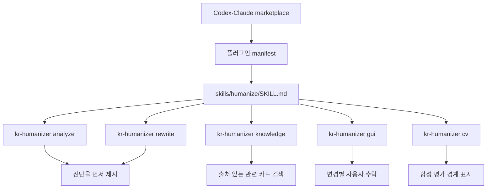
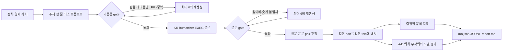
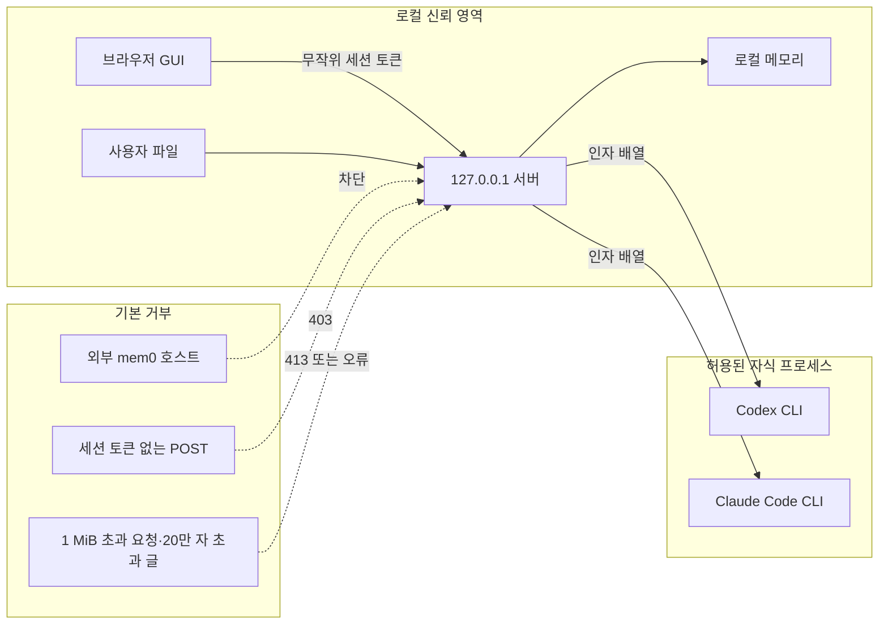

## Skill과 플러그인 작동 방식

Codex와 Claude용 manifest는 모두 같은 `humanize-korean-writing` Skill을 가리킵니다. Skill은 진단을 먼저 보여 주고 원본을 덮어쓰지 않으며, 어순 변경을 표시하고 사용자가 수락한 문장만 적용하도록 실행 순서를 정의합니다. 플러그인은 자체 모델이나 원격 서비스를 포함하지 않습니다. npm CLI를 호출하는 사용 지침과 실행 래퍼만 제공합니다.

### 다른 Humanizer에서 선별한 편집 원리

공개된 공식 기능 설명을 비교해 다음 원리만 독립적으로 구현했습니다. 외부 제품의 코드·프롬프트·규칙 데이터는 포함하지 않습니다.

| KR-humanizer 기능 | 참고한 공개 원리 | 적용 경계 |
|---|---|---|
| `fluent` 최소 수정 | [QuillBot Fluency는 문법과 자연스러움에 집중하고 변경과 동의어 치환을 줄임](https://help.quillbot.com/hc/en-us/articles/35854318883351-What-are-modes-in-the-QuillBot-Paraphraser-and-how-do-I-use-them) | 의미 없는 단어 교체 금지 |
| 독자 관점 말투 점검 | [Grammarly는 글이 더 친근하고 긍정적이며 자신감 있게 들리도록 문장별 말투 제안을 제공](https://support.grammarly.com/hc/en-us/articles/10674801783309-How-do-Grammarly-s-tone-suggestions-work) | 성격 판단이 아닌 독자가 받는 인상만 검토 |
| 격식·간결 조절 | [Wordtune은 Formal/Casual과 Shorten/Expand 제어를 제공](https://www.wordtune.com/rewrite) | 사실 추가 위험이 있는 Expand는 제외 |
| `strict` 엄격 검토 | [LanguageTool Picky Mode는 격식 문맥에서 더 많은 문법·문체 제안을 표시](https://languagetool.org/insights/post/picky-mode/) | 자동 반영하지 않고 문장별 수락 유지 |

윤문 방식은 `fluent`(최소 수정), `balanced`(균형 편집), `strict`(문체 혼용과 모호성까지 검토), `concise`(근거를 보존한 간결화) 네 가지입니다. 의미가 달라질 수 있는 창작 모드와 근거 없는 내용 확장은 넣지 않았습니다.

## 메모리 구조

- 기본 `LocalMemoryStore`는 `%USERPROFILE%/.kr-humanizer/memory.json`에 최대 500개의 결정을 보관합니다.
- 파일은 임시 파일에 먼저 쓴 뒤 `rename`하며, 생성 시 권한 모드는 `0600`을 요청합니다.
- 검색은 질의와 저장 문장의 공통 공백 토큰 수로 정렬하는 단순 로컬 방식입니다.
- mem0를 고르면 `127.0.0.1`, `localhost`, `::1`만 허용합니다. 검색 제한은 10초이며 외부 호스트 주소는 생성 단계에서 거부합니다.
- GUI의 `이번 선택을 로컬에 기억`을 눌러야 선택 ID가 저장됩니다. 자동 학습이나 백그라운드 업로드는 없습니다.

## 합성 CV 데이터 흐름

CV는 정치·경제·사회 각 3개 원문과 그 윤문을 만듭니다. 원문과 대응 윤문은 항상 같은 fold에 있어 pair 누수를 막습니다. 숫자 토큰 보존, 길이비, 가독성 대리 지표, 문체 구분기와 A/B 위치 무작위화 의견을 별도로 기록합니다. 평가 프롬프트에는 의미 보존 확인을 위한 참조 원문이 함께 제공되므로 평가자가 원문과 같은 문안을 식별할 수 있습니다. 따라서 완전한 블라인드 실험이 아니며, 같은 Codex 계열이 생성·윤문·평가한다는 점까지 포함해 실제 사람 선호나 AI 판별 회피 성능으로 해석할 수 없습니다.

## 보안과 신뢰 경계

- 서버는 모든 인터페이스가 아닌 `127.0.0.1`에만 바인딩합니다.
- HTML에 매 실행 무작위 토큰을 넣고 모든 POST 요청의 `x-kr-humanizer-token`과 비교합니다.
- 응답에는 CSP, `frame-ancestors 'none'`, `nosniff`, `no-referrer`, `no-store` 헤더를 설정합니다.
- 요청 본문은 1 MiB, 분석 원문은 200,000자, 엔진 출력은 2 MiB로 제한합니다.
- 비가시 문자 정리는 탐지된 Unicode 제어문자만 제거하고 NFC 정규화를 적용합니다. 이를 AI 워터마크 검출이나 제거라고 주장하지 않습니다.

## 현재 한계

- 규칙 기반 분석은 교정 후보를 보여 주며 국립국어원 수준의 완전한 문법 판정기가 아닙니다.
- 문장 정렬은 동일 인덱스를 우선하는 휴리스틱이라 문단 전체 재구성에는 적합하지 않습니다.
- 로컬 메모리 검색은 의미 임베딩이 아니라 토큰 겹침 점수입니다.
- 최신 사실 검증, 정치적 편향 평가, 실제 독자 실험은 현재 CV 범위 밖입니다.
